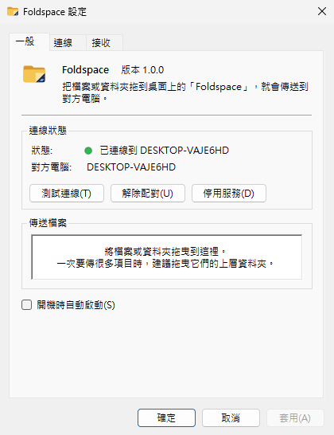
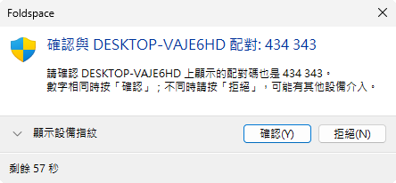
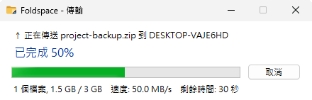
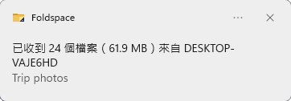

# Foldspace

[English](README.en.md) · [官方網站](https://yueyang666.github.io/Foldspace/)

在同一個區域網路裡的兩台 Windows 電腦之間傳檔案：把檔案或資料夾拖到桌面上的「Foldspace」，就會出現在另一台電腦的接收資料夾。

- **像資料夾一樣用**：桌面上的「Foldspace」看起來就是一般資料夾，拖進去就傳送，資料夾結構完整保留。
- **配對一次就好**：按「配對…」會自動找出同網段開著 Foldspace 的電腦，選一台後兩邊各自顯示 6 位數配對碼，雙方確認相同就記住彼此。之後只認對方的設備憑證，對方換了 IP 也會自動找回來。
- **安全**：控制連線一律用 TLS 與雙向憑證驗證；檔案內容預設也加密（可以關閉以換取速度）。
- **不會留下壞檔**：每個檔案都用 XxHash3 驗證，失敗會自動重傳；接收中斷時，接收資料夾裡不會出現不完整的檔案。
- **輕巧**：單一 exe、免安裝，常駐在系統匣，以顏色顯示連線狀態。平常不需要系統管理員權限，只有設定或移除防火牆規則時會跳出 UAC。
- **三種語言**：英文、繁體中文、簡體中文，跟隨 Windows 顯示語言。

## 畫面

<p>
  
  
</p>
<p>
  
  
</p>

## 系統需求

- Windows 10 21H2 以上或 Windows 11，x64
- 兩台電腦在同一個網段，彼此能以 TCP 連線（預設 port 52500），搜尋用 UDP 52500

## 開始使用

1. 從 [Releases](../../releases) 下載 `Foldspace-<版本>-win-x64.exe`，兩台電腦各放一份。可以用同一頁附的 `.sha256` 檢查檔案。
2. 執行 exe。
   - exe 沒有程式碼簽章，Windows 可能顯示「Windows 已保護您的電腦」，按「其他資訊 → 仍要執行」。
   - 第一次開啟時會跳出 UAC。允許後，Foldspace 會自動在 Windows 防火牆加上規則：只允許同一個子網路的電腦連入，私人與公用網路都適用。
3. 在設定視窗按「配對…」，從清單選擇對方電腦，兩邊確認顯示的 6 位數字相同。找不到對方時（例如訪客 Wi-Fi 擋掉了廣播），可以在「連線」分頁手動輸入對方的 IP。
4. 把檔案或資料夾拖到桌面上的「Foldspace」。收到的檔案預設在 `下載\Foldspace`。

同名檔案的處理方式（自動改名、覆蓋、略過）、接收前是否詢問、是否加密、開機自動啟動，都可以在設定視窗調整。

## 解除安裝

從「設定 > 應用程式」，或在開始功能表的「Foldspace」上按右鍵選「解除安裝」。程式本身、設定、配對資料、日誌、捷徑都會移除，接收資料夾裡的檔案會保留。移除防火牆規則需要系統管理員權限，會跳出 UAC 詢問。

## 從原始碼建置

需要 [.NET 10 SDK](https://dotnet.microsoft.com/download/dotnet/10.0)。

```bash
dotnet test tests/Foldspace.Core.Tests
dotnet publish src/Foldspace.App -c Release
```

產出的單一 exe 在 `src/Foldspace.App/bin/Release/net10.0-windows10.0.19041.0/win-x64/publish/Foldspace.exe`。macOS 與 Linux 也能建置 Windows 版 exe 和執行測試，只是不能執行 App。

程式架構、協定、檔案位置與設計決策見 [docs/design.md](docs/design.md)。

## 支持

Foldspace 永遠免費開源。如果你喜歡它，你的贊助可以幫忙讓 Windows 發行版變得更完整、更可信任，並且在未來支援更多作業系統。歡迎在 [Ko-fi](https://ko-fi.com/yueyang666) 支持。

[](https://ko-fi.com/R0V52861LJ)

## 授權

以 [Apache License 2.0](LICENSE) 授權。© 2026 yueyang

使用的第三方元件與其授權見 [THIRD-PARTY-NOTICES.md](THIRD-PARTY-NOTICES.md)。
